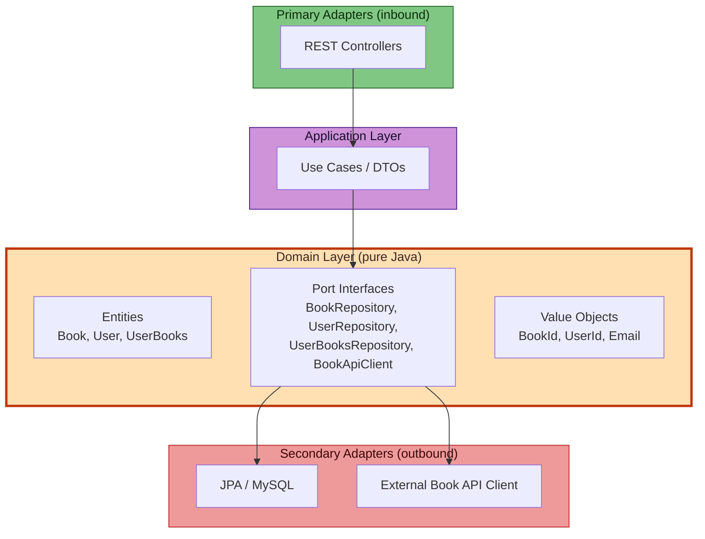

# Alexandria 📚

[](https://openjdk.org/projects/jdk/17/)
[](https://spring.io/projects/spring-boot)
[](https://www.mysql.com/)
[](https://github.com/jwtk/jjwt)
[](https://flywaydb.org/)
[](https://alistair.cockburn.us/hexagonal-architecture/)
[](LICENSE)

> **Alexandria** is a REST API for personal digital libraries — import books from open-source/public domain catalogs, manage your reading list with a state machine, and track progress.  
> Built with **Hexagonal Architecture (Ports & Adapters)**: the domain layer is pure Java with zero framework dependencies.

---

## Quick Start

```bash
git clone git@github.com:caarlatalita/alexandria.git
cd alexandria
docker-compose up -d          # MySQL 8.0 on :3306
./mvnw spring-boot:run        # API at :8080
```

---

## API Overview

All endpoints return JSON. Authentication is required except `/auth/register` and `/auth/login`.

### Authentication

| Method | Endpoint | Body | Response |
|--------|----------|------|----------|
| `POST` | `/auth/register` | `{ "username", "firstName", "lastName", "email", "password" }` | `201` — user created |
| `POST` | `/auth/login` | `{ "username", "password" }` | `200` — `{ "token", "userId", "username" }` |

### Books

| Method | Endpoint | Description |
|--------|----------|-------------|
| `GET` | `/books` | List all books (paginated) |
| `GET` | `/books/{id}` | Get book by ID |
| `POST` | `/books` | Import books from external API (`{ "page": 1 }`) |
| `PUT` | `/books/{id}` | Update book title |
| `DELETE` | `/books/{id}` | Delete a book |
| `GET` | `/books/search?query=` | Search books by title |

### Personal Library (User-Books)

| Method | Endpoint | Description |
|--------|----------|-------------|
| `GET` | `/user-books?status=` | List user's books (filterable by status) |
| `POST` | `/user-books` | Add book to library (`{ "bookId", "status" }`) |
| `PUT` | `/user-books/{id}` | Update status/progress/rating |
| `DELETE` | `/user-books/{id}` | Remove book from library |

### Reading State Machine

```
TOREAD ──→ READING ──→ DONE
```

- **TOREAD**: no extra fields required
- **READING**: requires `progress` (0–100)
- **DONE**: requires `rating` (0–10)

---

## Architecture



Dependencies point **inward**: controllers → use cases → ports → adapters.  
The domain layer imports **zero frameworks** — no Spring, no JPA, no HTTP libraries.

### Design Highlights

| Principle | How Alexandria Applies It |
|-----------|---------------------------|
| **S**ingle Responsibility | One use case class per operation (`CreateBookUseCase`, `DeleteBookUseCase`). Entities own their validation. |
| **O**pen/Closed | New book sources implement `BookApiClient`. Domain untouched. |
| **L**iskov Substitution | Every adapter conforms to its port contract. Swap implementations freely. |
| **I**nterface Segregation | Four focused ports instead of a monolith. |
| **D**ependency Inversion | Domain owns the interfaces. Infrastructure implements them. |

Key architectural decisions:
- **Explicit DI**: `BeanConfiguration` wires the graph manually — no `@Service` or `@Component` in domain/application layers.
- **Static factory methods**: `createFromExternalApi()` vs `restore()` prevents ID overwrites and centralizes validation.
- **Self-contained validation**: `UserBooks.validateByStatus()` lives in the domain entity, not in a service.

---

## Project Structure

```
com.pucsp.alexandria/
├── domain/               Pure Java. Entities, Ports, Value Objects, Domain exceptions.
├── application/          Use cases + DTOs. Depends only on domain.
├── adapter/
│   ├── in/rest/          @RestController classes (primary adapters).
│   └── out/persistence/  JPA entities, repositories, mappers, external API clients.
├── config/               BeanConfiguration, SecurityConfig, JWT filter chain.
└── advice/               GlobalExceptionHandler.
```

**Golden rule**: no infrastructure dependency crosses into `domain/` or `application/`.

---

## Tech Stack

| Category | Technologies |
|----------|-------------|
| **Core** | Java 17, Spring Boot 4.0.3, Maven |
| **Persistence** | Spring Data JPA, MySQL 8, Flyway |
| **Security** | Spring Security, JJWT 0.12.6, BCrypt |
| **Infrastructure** | Docker Compose, Testcontainers |

---

## License

[MIT](LICENSE)
