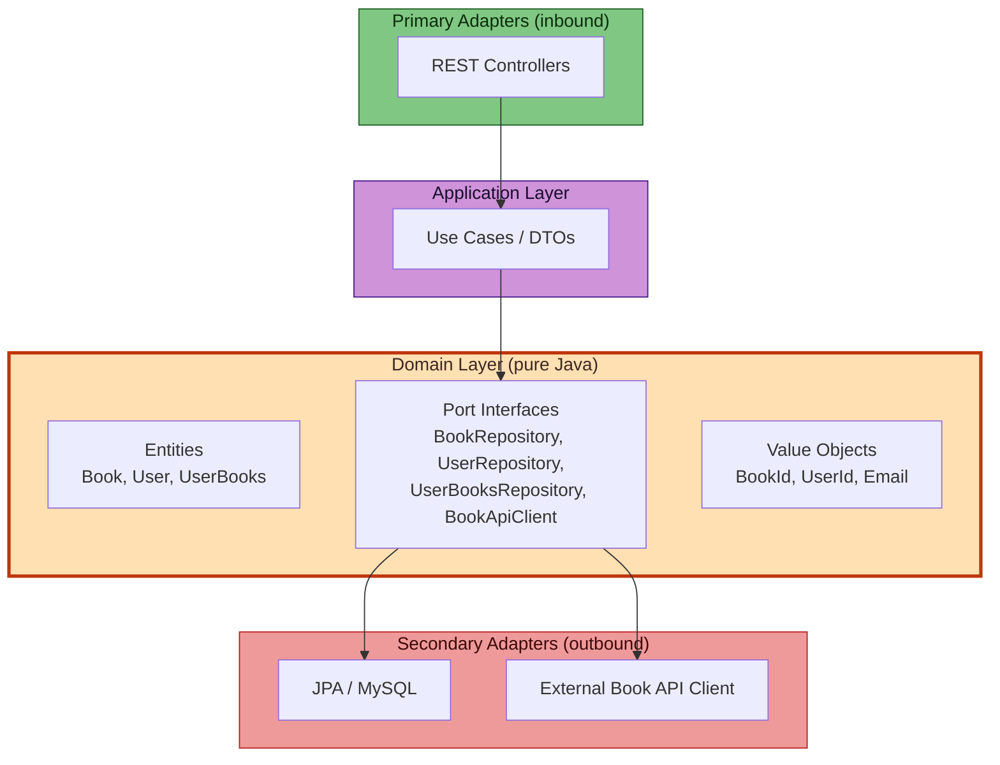

# Alexandria 📚

[](https://openjdk.org/projects/jdk/17/)
[](https://spring.io/projects/spring-boot)
[](https://www.mysql.com/)
[](https://github.com/jwtk/jjwt)
[](https://flywaydb.org/)
[](https://alistair.cockburn.us/hexagonal-architecture/)
[](LICENSE)

> A REST API for personal digital libraries, built with **Hexagonal Architecture (Ports & Adapters)**.  
> Integrates with external open-source/public domain book APIs, supports JWT authentication, and tracks reading progress across configurable states.

---

## Architecture



Dependencies point **inward**: controllers → use cases → ports (interfaces) → adapters.  
The domain layer imports **zero frameworks** — no Spring, no JPA, no HTTP libraries.

### Design Decisions

| Concern | Decision | Why |
|---------|----------|-----|
| **Dependency Injection** | Use cases receive ports via constructor in `BeanConfiguration` (no `@Service` in domain) | Domain never depends on Spring annotations |
| **Persistence** | Repository pattern: domain defines interfaces, infrastructure implements with JPA | Swap database without touching business logic |
| **External APIs** | `BookApiClient` port → adapters (ex.: Gutendex, Open Library, etc.) | Add new book sources via new adapter, domain unchanged |
| **Object creation** | Static factory methods (`create` vs `restore`) | Prevents ID overwrites, centralizes validation |
| **Validation** | Self-contained in domain entities (`UserBooks.validateByStatus()`) | Business rules live with the data they govern, not in services |

### SOLID Principles

| Principle | How Alexandria Applies It |
|-----------|---------------------------|
| **S**ingle Responsibility | One use case class per operation (`CreateBookUseCase`, `DeleteBookUseCase`). Domain entities own their validation logic. |
| **O**pen/Closed | New external book sources implement `BookApiClient`. Existing use cases and domain are untouched. |
| **L**iskov Substitution | Every repository adapter conforms to its port contract. Swap implementations freely. |
| **I**nterface Segregation | Four focused ports (`BookRepository`, `UserRepository`, `UserBooksRepository`, `BookApiClient`) instead of a monolith. |
| **D**ependency Inversion | Domain owns the interfaces. Infrastructure implements them. `BeanConfiguration` wires the graph. |

---

## Tech Stack

| Category | Technologies |
|----------|-------------|
| **Language & Framework** | Java 17, Spring Boot 4.0, Maven |
| **Persistence** | Spring Data JPA, MySQL 8, Flyway |
| **Security** | Spring Security, JJWT 0.12.6, BCrypt |
| **Infrastructure** | Docker Compose, Testcontainers |

---

## Domain Model

The domain consists of three aggregate roots and four value objects, all in `com.pucsp.alexandria.domain`.

### Aggregates

| Entity | Identity | Behavior |
|--------|----------|----------|
| **Book** | `BookId` (extends `Id<Long>`) | Factory methods: `createFromExternalApi()`, `createLocal()`, `restore()`. Immutable after construction. |
| **User** | `UserId` (extends `Id<Long>`) | Factory methods: `create()`, `restore()`, `updateWith()`. Encapsulates password hashing at infrastructure level. |
| **UserBooks** | Auto-generated `Long` | State machine: `TOREAD → READING → DONE`. `validateByStatus()` enforces field rules per state (progress for READING, rating for DONE). `updateWith()` returns new instance. |

### Value Objects

| Object | Validation | Usage |
|--------|-----------|-------|
| `Id<T>` (abstract) | Non-null, positive | Base class for `BookId`, `UserId` |
| `Email` | Regex pattern, lowercased | Stored in `User` |
| `BookSource` | Enum: `LOCAL`, `EXTERNAL` | Determines required fields per book type |
| `UserBooksStatus` | Enum: `TOREAD`, `READING`, `DONE` | Controls progress/rating validation rules |

### Creation vs Restoration

```java
// New entity — no ID assigned yet
Book.createFromExternalApi(externalId, title, author, ...);

// From persistence — ID must be provided
Book.restore(id, title, author, externalId, ...);
```

This pattern prevents accidental ID overwrites and keeps construction logic centralized.

---

## Project Structure

```
com.pucsp.alexandria/
├── domain/               Pure Java. Entities, Port interfaces, Value Objects, Domain exceptions.
├── application/          Use case classes + input/output DTOs. Depends only on domain.
├── adapter/
│   ├── in/rest/          @RestController classes (primary adapters).
│   └── out/persistence/  JPA @Entity, Spring Data repositories, mappers, external API HTTP clients.
├── config/               BeanConfiguration (explicit DI), SecurityConfig, JWT filter chain.
└── advice/               GlobalExceptionHandler (@RestControllerAdvice).
```

Key architectural rule: **no infrastructure dependency crosses into `domain/` or `application/`**.

---

## Key Features

- **Multiple book sources** — external API (open-source/public domain books) and local creation.
- **Personal library with state machine** — `TOREAD → READING → DONE` with per-state field validation.
- **JWT authentication** — HMAC-SHA256 tokens, BCrypt password hashing, stateless sessions.
- **Flyway migrations** — versioned schema changes, no manual DDL.
- **Centralized error handling** — domain exceptions mapped to HTTP responses via `@RestControllerAdvice`.

---

## Quick Start

```bash
git clone https://github.com/your-org/alexandria.git
cd alexandria
docker-compose up -d          # MySQL 8.0 on :3306
./mvnw spring-boot:run        # API at :8080
```

---

## Why This Project Matters

- **Clean Architecture** — `domain/` is pure Java 17. Zero Spring, JPA, or HTTP imports.
- **Use case–driven** — each operation is a dedicated class; no monolithic services.
- **Framework as adapter** — Spring Boot serves the domain, not the other way around.
- **Integration by contract** — external book APIs behind a `BookApiClient` port; swap implementations without touching domain logic.
- **Explicit dependency injection** — `BeanConfiguration` wires the graph manually. No `@Service` or `@Component` in domain or application layers.
- **Rich domain model** — entities with factory methods, immutable value objects, self-contained state validation.

---

## License

[MIT](LICENSE)
